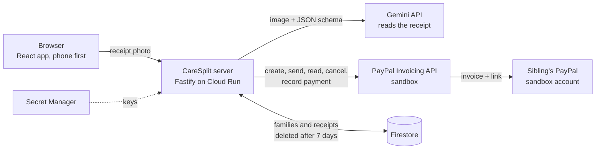

# CareSplit

**Siblings who share the pharmacy costs of an elderly parent: photograph the receipt, AI reads it, and every sibling gets their share as a PayPal invoice.**

| | |
|---|---|
| **Live demo** | https://caresplit-30747896454.europe-west4.run.app (no sign-up: you get a private demo family) |
| **Source code** | https://github.com/iancuileana83-lab/caresplit (this repository, MIT license) |
| **Built for** | the PayPal AI Hackathon on Devpost |
| **Demo video** | to be added before the submission |

CareSplit handles **amounts and dates only**. It gives **no medical advice**, stores **no health information**, and every receipt, person and PayPal account in the demo is **fictional** (PayPal runs in the **sandbox**).

---

## The problem

When a parent needs regular medicines, one sibling usually pays at the pharmacy and the others
"will pay their part later". Later turns into a notes app, a spreadsheet and a few awkward messages:
who owes what, was it paid, which receipt was that? The money is small, but the friction is not, and
it lands on the sibling who is already doing the most.

## Who it is for

Families of two to four adults who share the costs of a parent's care. The **organiser** is the
sibling who usually pays at the pharmacy; the others are the **siblings** who owe a share.

## What CareSplit does

1. **Photograph a receipt** (or pick one of six built-in fictional samples).
2. **AI reads it.** Gemini extracts the pharmacy, date, items, discounts, tax and total.
3. **You check it.** An editable review screen shows what was read, with a live **"Amounts add up"** check: items must add up to the subtotal, and subtotal minus discounts plus tax must equal the total.
4. **Choose the split.** Equal shares or custom percentages, set for the family and adjustable for one receipt. Odd cents stay with the organiser, so no sibling is billed a cent too much. Optionally add a **care credit**: the sibling who gives time (pharmacy runs, appointments, time with the parent) pays a smaller share, and the others share the difference. It is a family agreement shown openly, switchable per receipt, and visible on the caregiver's PayPal invoice as an item discount.
5. **Confirm and send.** One **PayPal invoice per sibling** is created and sent through the PayPal Invoicing API.
6. **See who paid.** The receipt page shows each share's status read back from PayPal. The organiser can cancel an invoice or record a payment made in cash or by bank transfer. Each sibling can "view as" themselves and sees only their own share.

Also built: a private demo family for every visitor (deleted automatically after 7 days), editable
family (2 to 4 people, each linked to a different PayPal sandbox buyer account), filters by month and
status with totals, "Reset demo", friendly errors and empty states, keyboard and screen-reader basics.

## How PayPal is used (central to the app)

Every amount the app calculates ends up as a real PayPal sandbox invoice, and PayPal stays the source
of truth for whether it was paid. We call the **PayPal Invoicing API v2** directly from the server
(OAuth2 client credentials, no SDK):

| Action in the app | PayPal call | Why it matters |
|---|---|---|
| Send invoices | `POST /v2/invoicing/invoices` then `POST .../{id}/send` | One invoice per sibling, for exactly their share, USD, due in 10 days |
| Never bill twice | `PayPal-Request-Id` header, and the draft's invoice id is saved *before* sending | A retry or a double click cannot create a second invoice |
| Show who paid | `GET .../{id}` ("Refresh status") | `PAID` and `MARKED_AS_PAID` both show as paid |
| Cancel an invoice | `POST .../{id}/cancel` | Withdraws it and notifies the sibling |
| Paid some other way | `POST .../{id}/payments` (cash, bank transfer, other) | The PayPal invoice and the family's books stay in agreement |
| Race safety | the live state is read from PayPal *before* cancelling or recording a payment | If the sibling paid a moment ago, the app refuses and updates itself instead of cancelling a paid invoice |
| Care credit | an item-level `discount` on the caregiver's invoice, and a check of the total PayPal calculates | The credit is visible on the invoice itself, and an invoice whose total differs from the share is never sent |

Safety around PayPal: sandbox only (the app refuses to talk to live PayPal), invoices can only go to a
fixed list of four fictional sandbox buyer accounts (no free-typed email addresses), the PayPal keys live
in Google Secret Manager and never in the code or the image, and sending is limited per visitor and per day.

## How AI is used (Gemini)

- **Receipt reading.** A photo goes to the Gemini API with a **JSON schema**, so the answer is structured data, not free text. The model is asked for merchant, date, currency, items, discount, tax and total, to ignore patient names, prescriptions and doses, and to treat any text on the receipt as data, never as instructions.
- **Trust, but verify.** The AI's numbers are never accepted blindly: the app re-checks the arithmetic (in whole cents) and the human confirms every receipt before anything is sent.
- **Resilient by design.** The server tries `gemini-3.5-flash-lite` first (about 1.4 s) and falls back to `gemini-3.8-flash`, `3.7-flash` and `3.6-flash`. A temporary overload (503) is retried, an exhausted quota (429) moves on to the next model, and if everything fails the user can type the receipt in by hand.
- **Private by construction.** The photo lives only in the server's memory for the length of one request. It is never written to disk, to the database or to a log.
- **Checked.** All six demo receipts (simple, 12 items, discounts, tax, a tilted and grainy "phone photo", non-medicine items) are read correctly; a script (`demo/verify-reading.mjs`) compares the answers with the values printed on them.

## Architecture



| Tool | How it is used |
|---|---|
| **PayPal Invoicing API v2 (sandbox)** | Creates, sends, reads, cancels and settles one invoice per sibling (see above) |
| **Gemini API** | Reads receipt photos into structured data (vision + JSON schema), with model fallback |
| **Google Cloud Run** | Hosts the app (one container: web app and API), scales to zero, at most 2 instances |
| **Cloud Build, Artifact Registry** | Build the container image and keep it |
| **Firestore** | Stores each visitor's family and receipts; a TTL policy deletes them after 7 days |
| **Secret Manager** | Holds the PayPal and Gemini keys; the service account can read only those three secrets |
| **React 19, Vite, Tailwind CSS** | Mobile-first interface, built from simple components with accessibility in mind |
| **Fastify 5, TypeScript, Node 24** | The API: validation, limits, PayPal and Gemini calls |
| **Vitest, jsdom** | 158 automated tests (money maths, rules, API, PayPal calls with a fake PayPal, screens) |
| **Claude Code** | Pair-programmed the whole project (see the last section) |

## Try it (for judges), about 3 minutes

1. Open https://caresplit-30747896454.europe-west4.run.app. A private demo family (Anna, Ben, Clara) with three sample receipts is created for your browser. Nobody else can see it.
2. **Add receipt** → **Try a sample** → pick one (the tilted phone photo is a good test). Wait a few seconds for the AI.
3. **Review**: change an amount and watch **"Amounts add up"** turn into a warning, then fix it. **Continue**.
4. **Split & send**: try **Custom percentages** (for example 50 / 30 / 20), then **Send PayPal invoices** and confirm. Real invoices are created in the PayPal sandbox.
5. On the receipt: **View invoice** opens the PayPal sandbox invoice page. **Mark as paid** (cash) or **Cancel invoice** change the invoice in PayPal; **Refresh status** reads PayPal's state back.
6. **View as Ben / Clara** (top of the page): each sees only their own share and their invoice link.
7. **Family**: change names or the split, add a fourth person, or **Reset demo**. Try **Care credit**: tick it, pick Ben and 25 %, save, then add a receipt: on **Split & send** you will see Ben's share drop and the others' rise, and Ben's invoice will carry the credit as a discount.

To actually *pay* an invoice as a sibling you need to sign in to the PayPal sandbox with one of the four
fictional buyer accounts; their test logins are given in the Devpost "testing instructions". Without them
you can still see the whole loop with "Mark as paid", which records the payment on the PayPal invoice.

**Please use the sample receipts or a made-up receipt, not a real one.** If the AI is busy or out of quota, choose "Enter it by hand".

Limits protect the demo and its keys. Per visitor address, per minute: 6 receipt readings, 20 saves and
6 PayPal actions. For the whole app, per day: 300 readings, 300 saves and 100 PayPal actions. If you hit one, wait a minute
(or come back tomorrow for the daily ones).

## Run it locally

You need Node.js 22 or newer.

```bash
npm install
npm run dev
```

Open http://localhost:5173 (`npm run dev` starts the API on port 3001 and the web app on 5173; in Windows
PowerShell use `npm.cmd` if scripts are blocked). With no keys, the app starts with data in memory and you
can type receipts in by hand. To turn on the full flow, copy `.env.example` to `.env` (it is git-ignored) and fill in:

| Variable | What it is |
|---|---|
| `PAYPAL_ENV=sandbox` | Required for PayPal to switch on; the app never talks to live PayPal |
| `PAYPAL_CLIENT_ID`, `PAYPAL_CLIENT_SECRET` | A PayPal **sandbox** REST app linked to a **US Business** sandbox account with the **Invoicing** feature ticked |
| `GEMINI_API_KEY` | A key from https://aistudio.google.com/apikey |
| `DATA_STORE=firestore` | Optional: keep data in Firestore (needs `gcloud auth application-default login`); otherwise memory |

Other commands: `npm test` (158 tests), `npm run typecheck`, `npm run build`, `npm start` (the built app on port 3001),
and `node demo/verify-reading.mjs` (reads the six sample receipts through a running server and checks them).

### Deploy to Google Cloud Run

Create a Firestore database (Native mode), a service account for the service with access to that database
only, and three secrets (`caresplit-paypal-client-id`, `caresplit-paypal-client-secret`, `caresplit-gemini-api-key`)
readable by that account. Then:

```bash
gcloud builds submit . --tag REGION-docker.pkg.dev/PROJECT/REPO/caresplit:v1 --region REGION
gcloud run deploy caresplit --image REGION-docker.pkg.dev/PROJECT/REPO/caresplit:v1 --region REGION \
  --service-account SERVICE_ACCOUNT --allow-unauthenticated --max-instances 2 --memory 512Mi \
  --set-env-vars DATA_STORE=firestore,PAYPAL_ENV=sandbox,GCP_PROJECT=PROJECT \
  --set-secrets PAYPAL_CLIENT_ID=caresplit-paypal-client-id:latest,PAYPAL_CLIENT_SECRET=caresplit-paypal-client-secret:latest,GEMINI_API_KEY=caresplit-gemini-api-key:latest
gcloud firestore fields ttls update expireAt --collection-group=families --enable-ttl --database=DATABASE
gcloud firestore fields ttls update expireAt --collection-group=receipts --enable-ttl --database=DATABASE
```

## Safety, privacy and data

- **Fictional data only.** The demo is for made-up receipts; the Add receipt screen says so.
- **Photos are never stored.** They go to the Gemini API for one request and are then gone. Note that Google's terms for the free Gemini tier allow it to use inputs to improve its products, which is why real receipts must not be uploaded.
- **No health information, no medical advice.** Only the pharmacy, date, item names, amounts and totals are kept; the reading is told to ignore patient names, prescriptions and doses.
- **Private demo families.** Each browser gets a random id that names its own family; other visitors cannot read it, and Firestore deletes it after 7 days. There is no login: the id works like a private link.
- **Secrets stay out of the code.** Keys live in a git-ignored `.env` locally and in Secret Manager on Cloud Run; the git history was searched for their exact values and none was found.
- **Input is validated and limited** (sizes, amounts, names, per-visitor and per-day limits, one trusted proxy hop for the visitor address).

## Known limitations (honest list)

- **Sandbox only.** No real money moves, and the app will not talk to live PayPal.
- **No login.** The "View as" switcher is a demo convenience, not a security boundary.
- **Status needs a refresh.** The app reads PayPal's status when you press "Refresh status"; PayPal webhooks (automatic updates) are planned.
- **Buyer payment not yet watched end to end.** We verified creating, sending, reading, cancelling and settling invoices against the real sandbox, but PayPal's sandbox website was slow and our own test of a buyer paying through the invoice page did not complete. In-app Checkout and webhooks are planned.
- **Free-tier AI quota is small.** The model chain softens this, but a busy day can exhaust it; manual entry always works.
- **USD only, 2 to 4 people,** and the AI was tested only on English, US-style receipts.
- **Four fixed sandbox buyer accounts,** so invoices can only go to those.

## What is next

A care log that suggests the care credit from hours given (level 2 of the care credit, see `ROADMAP.md`), paying a share inside the app
with PayPal Checkout (Orders API), PayPal webhooks, an AI assistant that answers questions about the family's spending
(and later acts through PayPal's agent tools, always with confirmation), checks for duplicate or unusual receipts, polite
AI-written reminders, and a downloadable monthly report. The full phased plan is in [ROADMAP.md](ROADMAP.md).

## Built with Claude Code

CareSplit was built in pair with **Claude Code**, Anthropic's coding agent. The author (Ileana Mazilu) set the idea,
the rules and the priorities, approved every step, tested on the live app and decided what to cut; Claude Code planned each step, wrote the code and the tests, ran the checks, and
ran the Google Cloud commands only after the author approved each one. All commits carry a `Co-Authored-By` line for it.
Guardrails the author set from the start: secrets only in a local `.env` or Secret Manager, fictional data only,
ask before changing the cloud project, small tested steps. (The AI *inside* the product is Gemini, not Claude.)

## Project layout

```
web/        React app (screens in src/pages, pieces in src/components, helpers in src/lib)
server/     Fastify API: app.ts (routes), gemini.ts, paypal.ts, invoices.ts, store.ts, firestore-store.ts, limits.ts, validate.ts
shared/     Code used by both: money.ts (cents), split.ts (equal and percentage splits), receipt-check.ts ("amounts add up")
demo/       Six fictional receipts with their true values, the generator, and the reading checker
spikes/     Small experiments from the first days (PayPal invoice, Gemini reading)
Dockerfile  Two-stage build for Cloud Run
ROADMAP.md  The phased plan, what is done and what is next
```

## License

MIT, see [LICENSE](LICENSE).
